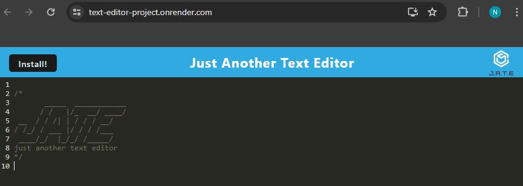

# JATE Progressive Web App Project

## Description
This project entailed the refactoring of a text editor web application into a progressive web app by adding a service worker for offline functionality and making the application installable to a local device.  The application, called Just Another Text Editor, is a web text editor that saves your data when the application goes out of focus, namely if you click on another portion of the window or go to another tab.  This allows your data to persist across sessions and across network difficulties.

## Installation
No installation necessary, the application can be accessed in its deployed state on [Render](https://text-editor-project.onrender.com/)

## Usage
The following is a screenshot of the landing page of the deployed application:  

Users can treat JATE just like any other web text editor they might use, such as Google docs or other alternatives.  Beginning at line 10 following the application logo, users can enter whatever text they would like to record and, when they take a break and switch tabs, leave their computer, or put their phone down, the data they recorded will automatically be stored in a browser database.  Thus, when the user returns to work on the project they began, they can pick up right where they left off, regardless if the computer or phone remained connected to the internet that entire time.

Further, if the user would prefer to install the app locally on their device they can click the install button in the blue header bar or the install symbol on the far right of the address bar of their browser.  Functionality of the installed application will be essentially the exact same as the functionality of the web application.

## Contributing
N/A

## Tests
N/A

## Credits
This application draws heavily from the Module 19 mini project, particularly for the syntax of the api routes.  Additionally, I received a lot of help from a bootcamp tutor,  Chris Baird, specifically on debugging the indexedDB storage functionality as well as properly registering my service worker for the application.

